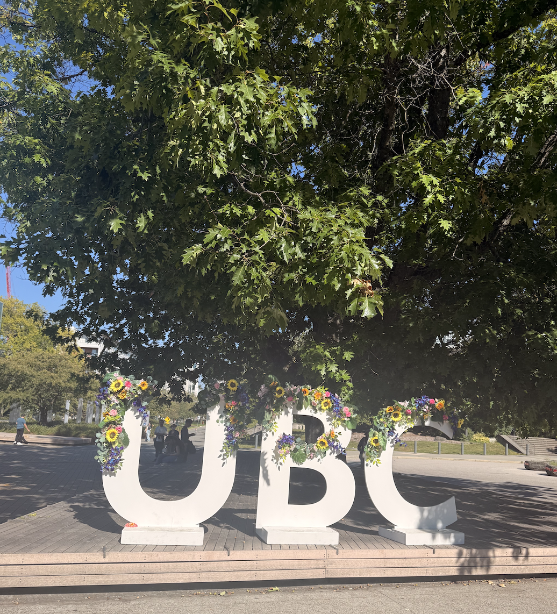

::: {.text-center}
{width="70%"}
:::

## Getting Started

Starting the Master of Data Science program at UBC has been an exciting but challenging experience. After being away from school for several years, getting back into a full-time academic routine has taken some adjustment.

## The First Few Weeks

The first few weeks have been a lot of learning and trying to keep up with a fast-paced program. I have been working with Python, R, statistics, Git, and Quarto, while also getting used to the workflow of working on assignments and projects.

One of the biggest challenges has been realizing how much there is to learn in a short amount of time. Some concepts take me longer to understand, but I am gradually becoming more comfortable with the tools and the way of thinking required in data science.

At the same time, being back on campus and meeting other students has been a positive part of the experience. It has been nice to be part of a community again and to learn alongside people with different backgrounds and experiences.

## Looking Ahead

I am looking forward to becoming more confident with the technical and statistical concepts I am learning. My goal is to build practical data science skills that I can eventually apply to real-world problems and meaningful projects.
